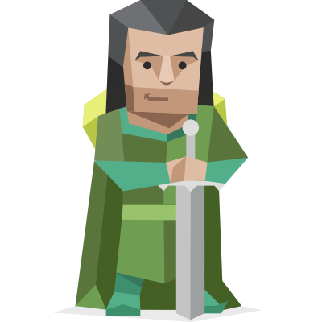
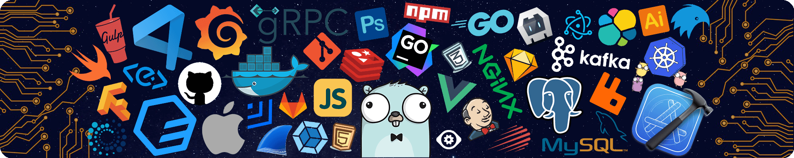

  
# 🚀 Callen's World 🚀

###  Hi there! I'm a passionate programmer  

---

  <h3>:snowman: 我的博客 / My Blog</h3>
  
  

  
  
  
  
  
  

  ---
  

  <h3>💻 GitHub档案 / Github Profile</h3>
  <!-- https://github.com/anuraghazra/github-readme-stats -->

  
  
   

  <h3>🔥 我的贡献 / Contributions</h3>
  <!-- GitHub Readme Streak Stats - https://github.com/DenverCoder1/github-readme-streak-stats -->
  

    
  

<h3>🚀 我的github活动 / Activities</h3>

  

  

---
### 🌟 性格方向 

  充满热情和理想的 Protagonist（ENFJ-T） 
  - 🌍 内向性: 58%  
  - 🔮 直觉性: 60%  
  - ❤️ 情感性: 82%  
  - 🧠 判断性: 63%  
  - 🌪️ 动荡性: 71%

---

## 💻 技术栈

### 前端技术栈

### 工具 & 平台

---

## 📞 联系我

---

  <h3>❤️ 公益服务 / Public Service</h3>
  <h4>图床：<a href="https://by.ezlk.top">ImgHub(密码:zxy)</a></h4>

---

### 🎯 持续学习，持续进步

*"坚信熟能生巧，努力改变人生"*

⭐️ 如果喜欢，请给我一个Star吧！

